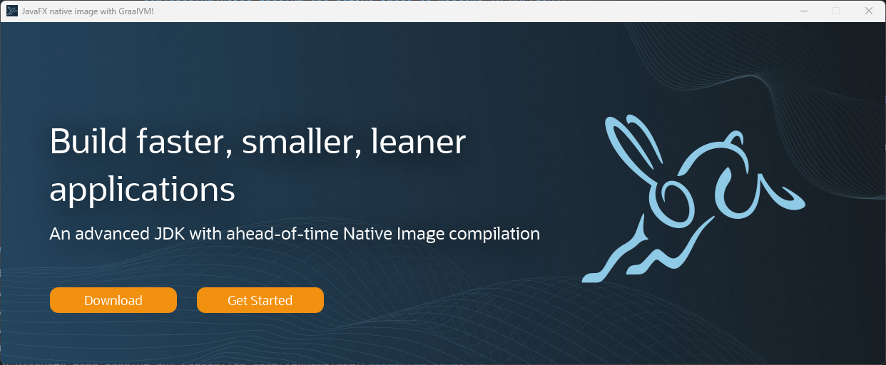

# JavaFX Native Demo

This is a demo of a JavaFX application generated as a native image (for Windows) thanks to GraalVM (JDK 23). It uses the Native image plugin for Maven (version 0.10.3). 

The JavaFX demo uses FXML for describing the GUI:


## How to build?

To build it, you need to first follow [installation instructions for Visual Studio Build Tools for Windows](https://medium.com/graalvm/using-graalvm-and-native-image-on-windows-10-9954dc071311).

Then, you'll need to configure properly your Maven environment, either using `.idea/workspace.xml` if you're using Intellij IDEA or your shell if using Maven.

Build using: `mvn verify`

## What is generated?

Inside the `./target` folder, you'll find the jar file as well as the native image `javafx-demo-native.exe` and some dlls. To allow for deployment of this simple demo, you'll need at least: the exe file along `java.dll` and `jvm.dll` libraries. These will allow opening a browser to the registered GraalVM website URLs when clicking on the buttons.

## Final note

If you wish to make disappear the console whenever you start the native image, you'll need to run the following command (given your environment is properly setup): 
```shell
editbin /SUBSYSTEM:WINDOWS target\javafx-demo-native.exe
```
